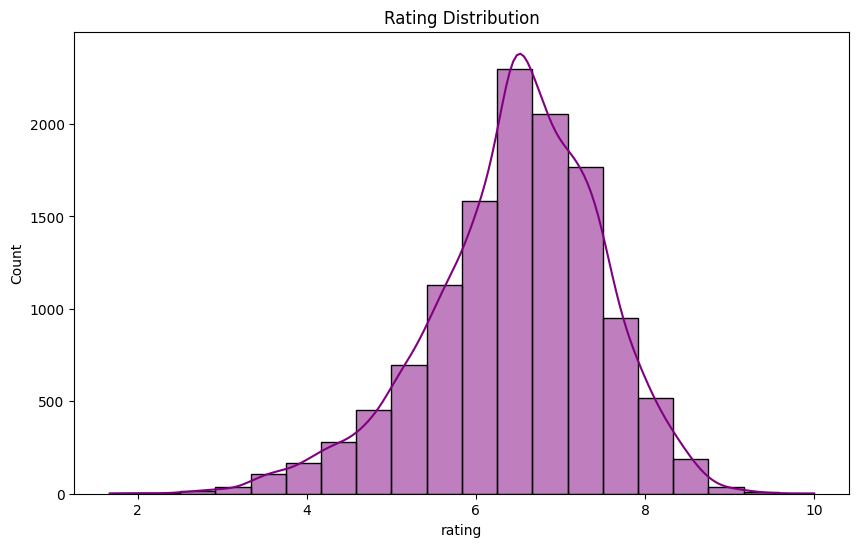

# Anime Data Analysis 📊

## About
This project performs a comprehensive **Exploratory Data Analysis (EDA)** on a dataset containing over 12,000 anime records. The goal is to understand the factors that drive user ratings, the distribution of content types, and how the length of a series impacts its overall success.

## Purposes Of The Project
The main objective of this project is to answer key questions about the anime industry trends:
1. Which content types (TV, Movie, OVA) receive the highest ratings?
2. Is there a correlation between the number of episodes and the user rating?
3. What are the most dominant genres in the market?
4. How does popularity (number of members) relate to the quality (rating) of the work?

## About Data
The dataset was obtained from Kaggle and contains information on anime user preferences.

| Column | Description |
| :--- | :--- |
| **anime_id** | Unique ID identifying an anime. |
| **name** | Full name of the anime. |
| **genre** | Comma-separated list of genres for this anime. |
| **type** | Type of broadcasting (e.g., TV, Movie, OVA). |
| **episodes** | Number of episodes (1 for movies). |
| **rating** | Average rating out of 10. |
| **members** | Number of community members in the anime's group. |

## Technical Stack
* **Language:** Python
* **Libraries:** Pandas, NumPy, Matplotlib, Seaborn, WordCloud

## Analysis Steps (Methodology)

### 1. Data Wrangling
* Handled missing values (NaNs) in ratings and genres.
* Converted the `episodes` column to numeric format, handling non-numeric strings.
* Cleaned the `name` column to remove special characters.

### 2. Feature Engineering
* **Episode Categorization:** Created a new categorical feature to group anime by length:
    * `Movie (1)`
    * `Short (2-13)`
    * `Standard (14-26)`
    * `Medium (27-52)`
    * `Long (53-100)`
    * `Super Long (100+)`

### 3. Exploratory Data Analysis (EDA)
* **Rating Distribution:** Visualized the density of ratings across the entire dataset.
* 
* **Type Analysis:** Compared average ratings between Movies and TV series using Boxplots.
* **Genre Popularity:** Extracted individual genres to find the most frequent categories using a WordCloud.
*
## Key Insights 💡
* **Movies vs. TV:** Movies tend to have higher and more consistent ratings compared to long-running TV series.
* **Success Filtration:** "Super Long" series (100+ episodes) maintain very high ratings, as only the most successful shows are allowed to continue for that long.
* **Genre Dominance:** Comedy and Action are the most frequent genres, but Drama often holds higher average ratings.
*
###📊 Sample Visualizations
